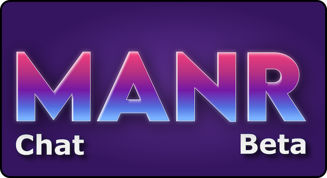
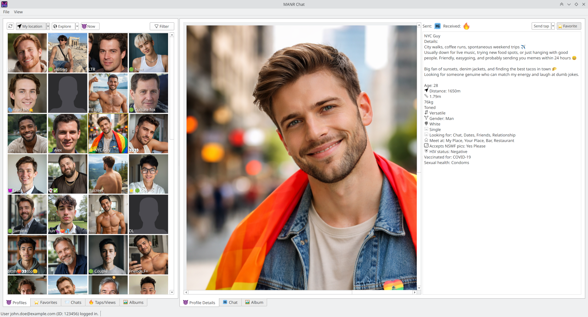

# MANR



MANR (/ˈmɛnɐ/, from German word "Männer" for men) is an alternative chat client for the Grindr social network which aims to provide a better user experience. It is an unofficial client and in no way related to or endorsed by Grindr, Inc. The software is a reimplementation of the client side and contains no code from the official client.

## Installation

Manual installation steps:

1) Download and install [Python](https://www.python.org/downloads/), if you do not have it installed already. (If you are already using Python and know what you're doing, you may want to create a virtual environment.)
2) Download the contents of this repository with the "Download ZIP" option and unzip it to where you want to save the application.
3) Install Python dependencies: Open a terminal window in the directory where you unzipped the application files and run the following command:
```
pip install -r requirements.txt
```
4) Run the application by starting `app.py`.
5) Optionally: create a shortcut to `app.py` to quickly start it. There's an app icon you can use in `./manr/resources/img/icon.ico`.

TODO: Installer / Release artifacts 

### Uninstall

Simply delete the application folder. Additionally, delete settings and caches in `%APPDATA%/manr` and `%LOCALAPPDATA%/manr`.

## Usage



If you don't have a Grindr account already, use the official app first to create an account and set up your profile. Account creation is usually only done once and not yet implemented in MANR.

On first use of MANR, you should see the login dialog. Here you can enter your account credentials, i.e. email address and password, to log in. Once an account is set up you can be logged in automatically the next time you start MANR. Toggle the "File -> Log in automatically" option to change that. You can manage multiple accounts and quickly log in using the "File -> Log in as" menu.

**NOTE:** If you want to switch accounts, please restart the software. Logging in to another account while already logged in is possible but currently buggy.

To display profiles nearby you, set up your location first. The down arrows near the "My location" and "Explore" buttons will show a popup menu listing all your saved locations and allow you to "Edit locations...". On first use, you need add your current location here, first.

Choosing a location in the "My location" view actively sets your Grindr location and where you appear to other users. Choosing a location in the "Explore" view only changes which users close to that location are displayed to you.

**WARNING:** Switching between different locations works fine and is intended for the "Explore" view. However, rapidly changing your own location by switching around in the "My location" view could be detected by Grindr as GPS spoofing / teleporting and may get your account flagged.

## Features

MANR contains most commonly used basic chat functionality, but certain features are still missing. Some featured are important but rarely used and thus not implemented yet, some I consider unnecesary.

Features include:
- Browse list of nearby user profiles, explore locations, and view "right now" profiles. "For You" profiles appear at the end of the nearby list.
- Set current location, save list of favorite "explore" locations
- View profile details of users
- Chat with users, including pictures, location, reactions
- View received albums
- Upload pictures
- Send and receive taps
- Add favorites, view list of favorites
- View list of users you received taps from, sent taps to, or who viewed your profile.
- Search filters
- Manage multiple user accounts

Missing features:
- Creating an account. Please use the official app to create an account and fully set up your profile. Then enter your account credentials (email, password) into the login dialog.
- Changing own user profile text / stats / profile picture.
- Creating and sending albums. (Note: sending individual pictures is implemented)
- Translations, including server provided translations for tags, genders, etc.
- "Taken on Grindr" watermark (Planned)
- Sending location (Planned)
- Some other minor fields in the user profile
- "Explore locations" in the user grid. These are stupid anyway and won't be implemented.

## License

You may use this software under either the [CC0](https://creativecommons.org/public-domain/cc0/) license or the [Unlicense](LICENSE), per your choice. Basically, do whatever you want with it, as long as you respect third party IP.

### Third party code

This repository contains vendored copies of the following open source libraries:

- [Leaflet](https://leafletjs.com): an open-source JavaScript library for mobile-friendly interactive maps. [(BSD 2-Clause License)](manr/leaflet/LICENSE)
- [grindr-access](https://github.com/Slenderman00/grindr-access): A simple module for accessing the Grindr REST API.
MANR builds on this functionality, but contains a fork that is heavily modified and extended. [(MIT License)](manr/grindr_access/LICENSE)

### Disclaimer

Unauthorized use or misuse may violate Grindr Inc.'s terms of service and could result in account suspension. Use this at your own risk.

THIS SOFTWARE IS PROVIDED BY THE COPYRIGHT HOLDERS AND CONTRIBUTORS "AS IS"
AND ANY EXPRESS OR IMPLIED WARRANTIES, INCLUDING, BUT NOT LIMITED TO, THE
IMPLIED WARRANTIES OF MERCHANTABILITY AND FITNESS FOR A PARTICULAR PURPOSE ARE
DISCLAIMED. IN NO EVENT SHALL THE COPYRIGHT HOLDER OR CONTRIBUTORS BE LIABLE
FOR ANY DIRECT, INDIRECT, INCIDENTAL, SPECIAL, EXEMPLARY, OR CONSEQUENTIAL
DAMAGES (INCLUDING, BUT NOT LIMITED TO, PROCUREMENT OF SUBSTITUTE GOODS OR
SERVICES; LOSS OF USE, DATA, OR PROFITS; OR BUSINESS INTERRUPTION) HOWEVER
CAUSED AND ON ANY THEORY OF LIABILITY, WHETHER IN CONTRACT, STRICT LIABILITY,
OR TORT (INCLUDING NEGLIGENCE OR OTHERWISE) ARISING IN ANY WAY OUT OF THE USE
OF THIS SOFTWARE, EVEN IF ADVISED OF THE POSSIBILITY OF SUCH DAMAGE.